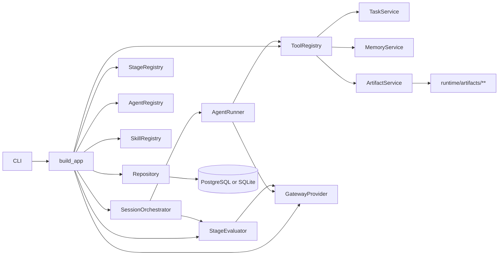
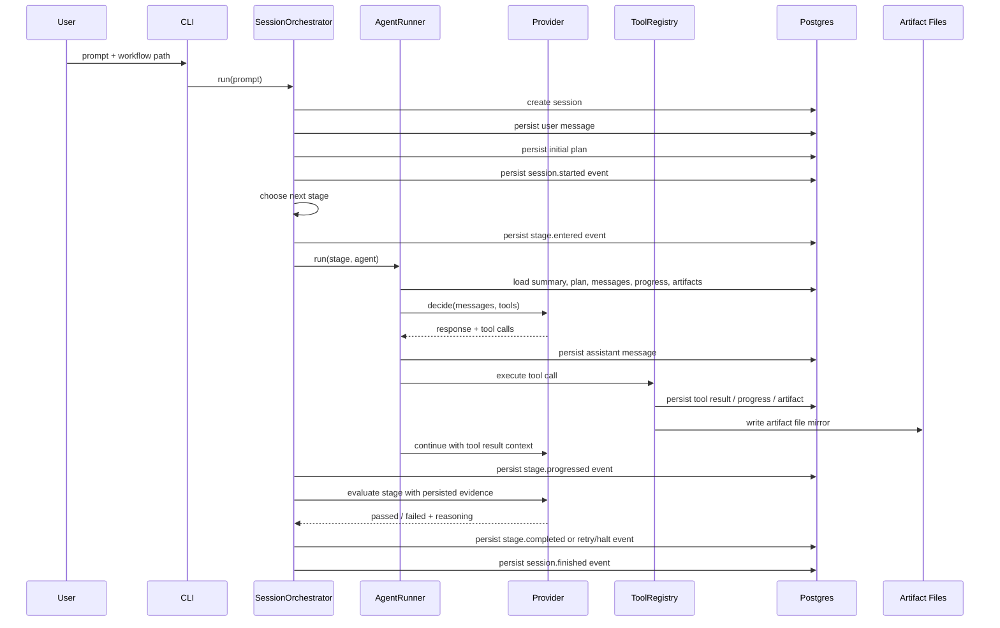
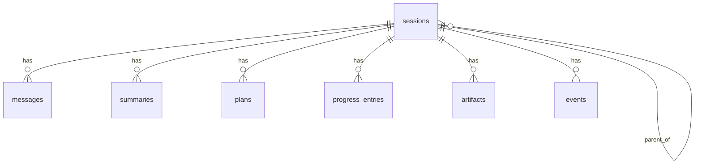
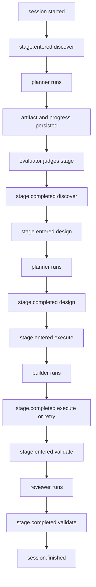

# Runtime Architecture

This document describes how the `dmf2-agents` runtime works based on the checked-in code and the persisted run data currently stored in PostgreSQL. It covers the workflow model, architecture, agents, services, permissions, storage, tools, skills, provider integration, messaging and context flow, and example runs with intermediate results.

## Overview

`dmf2-agents` is a stage-driven multi-agent runtime built in Python on top of LangGraph. A run starts from a workflow YAML file and a user prompt. The workflow defines ordered stages, each stage is assigned to an agent, and the runtime persists the full session state into a database while also mirroring artifacts to disk.

At a high level, the system does this:

1. Loads runtime configuration and provider settings.
2. Loads a workflow YAML file into an ordered stage registry.
3. Creates a durable session and persists the user request.
4. Derives an initial plan directly from the workflow.
5. Runs each stage through the assigned agent.
6. Persists messages, progress, artifacts, and events while the agent works.
7. Evaluates whether the current stage goal is satisfied.
8. Advances, retries, or halts.

The main runtime modules are assembled in `src/dmf2_agents/bootstrap.py`.

## Main Components

The runtime is composed from small services with explicit boundaries.


| Component        | Responsibility                                               | Key file                          |
| ---------------- | ------------------------------------------------------------ | --------------------------------- |
| CLI              | Parses prompt and workflow path, starts the app              | `src/dmf2_agents/cli.py`          |
| Bootstrap        | Wires the whole runtime together                             | `src/dmf2_agents/bootstrap.py`    |
| Config           | Loads `.env` and runtime settings                            | `src/dmf2_agents/config.py`       |
| Logging          | Configures pretty stdout plus JSON file sinks with context   | `src/dmf2_agents/logging.py`      |
| Stage registry   | Loads workflow YAML into `StageDefinition` objects           | `src/dmf2_agents/stages.py`       |
| Agent registry   | Declares built-in agents and tool permissions                | `src/dmf2_agents/agents.py`       |
| Tool registry    | Exposes runtime tools and enforces per-agent permissions     | `src/dmf2_agents/tools.py`        |
| Skill registry   | Loads reusable instruction bundles from `skills/**/SKILL.md` | `src/dmf2_agents/skills.py`       |
| Prompt builder   | Assembles runtime context into the provider prompt           | `src/dmf2_agents/prompting.py`    |
| Agent runner     | Runs iterative provider/tool turns for a stage               | `src/dmf2_agents/runner.py`       |
| Evaluator        | Judges whether a stage goal is satisfied                     | `src/dmf2_agents/evaluators.py`   |
| Orchestrator     | Runs the stage graph with LangGraph                          | `src/dmf2_agents/orchestrator.py` |
| Repository       | Async persistence wrapper over SQLAlchemy tables             | `src/dmf2_agents/repository.py`   |
| Storage          | SQLAlchemy schema and DB session management                  | `src/dmf2_agents/storage.py`      |
| Memory service   | Manages messages, plan, summary, progress                    | `src/dmf2_agents/memory.py`       |
| Artifact service | Persists artifacts to DB and mirrors them to files           | `src/dmf2_agents/artifacts.py`    |
| Event bus        | Persists runtime events and notifies subscribers             | `src/dmf2_agents/events.py`       |
| Task service     | Spawns child sessions for subagent work                      | `src/dmf2_agents/tasks.py`        |
| Provider adapter | Azure OpenAI-backed structured response and tool calling     | `src/dmf2_agents/providers.py`    |


## Architecture Diagram




## Runtime Entry and Bootstrapping

The CLI is intentionally small. It takes a prompt and an optional `--workflow` path, builds the app, runs the orchestrator, and prints the resulting session id.

Relevant code:

- `src/dmf2_agents/cli.py:10`
- `src/dmf2_agents/bootstrap.py:23`

Bootstrap does the following in order:

1. Loads settings with `get_settings()`.
2. Configures runtime logging.
3. Opens the configured database via `Database(settings.database_url)`.
4. Calls `database.create_all()`.
5. Creates `Repository`, `MemoryService`, `ArtifactService`, and `EventBus`.
6. Loads the workflow YAML into `StageRegistry`.
7. Creates the built-in `AgentRegistry`.
8. Loads skills from `skills/`.
9. Builds the `PermissionService` from each agent's allowed tool list.
10. Creates `ToolRegistry`.
11. Builds the provider client from Azure OpenAI settings.
12. Creates the stage evaluator.
13. Creates the `AgentRunner`.
14. Wires `TaskService` into the tool registry as the subagent executor.
15. Returns `SessionOrchestrator`.

One important implementation detail: there is no separate migration toolchain yet. Schema creation currently depends on `Base.metadata.create_all(...)`, which is fine for fresh databases but not a durable schema migration strategy.

## Runtime Logging

The runtime now initializes logging once during bootstrap and uses two sinks:

1. Pretty human-readable logs to `stdout`
2. JSON-serialized logs to a file when `LOG_FILE` is configured

By default, the JSON log file path is `runtime/logs/dmf2-agents.jsonl`.

The logging implementation lives in `src/dmf2_agents/logging.py` and uses `contextvars` to enrich every log record with runtime context when available:

- `session_id`
- `parent_session_id`
- `agent_name`
- `stage_id`

That context is bound at runtime boundaries such as:

- top-level session execution in `SessionOrchestrator.run()`
- stage execution in `SessionOrchestrator._run_stage()`
- stage evaluation in `SessionOrchestrator._evaluate()`
- iterative agent turns in `AgentRunner.run()`
- child task sessions in `TaskService.run_subagent()`

The current instrumentation focuses on high-signal lifecycle events rather than full payload logging. Examples include:

- session start and finish
- stage selection and evaluation
- agent iteration start and finish
- provider decision receipt
- tool call start, completion, denial, and failure
- subagent session start and finish

The current implementation intentionally avoids logging full prompt bodies, artifact contents, or full tool outputs by default.

## Workflow YAML

Workflows are the primary source of runtime structure.

The stage loader is minimal by design:

- `StageRegistry` reads a YAML file.
- It validates each item into a `StageDefinition`.
- Stage order is preserved from the YAML list.

Relevant code:

- `src/dmf2_agents/stages.py:10`
- `src/dmf2_agents/domain.py:31`

`StageDefinition` supports these fields:

- `id`
- `name`
- `goal`
- `assigned_agents`
- `completion_conditions`
- `max_loops`
- `output_artifacts`
- `evaluation_mode`

### Example: SQL Migration Workflow

`examples/migration-clean.yaml` defines four stages:

1. `discover`
2. `design`
3. `execute`
4. `validate`

Each stage points to one built-in agent and uses provider-backed evaluation.

```yaml
stages:
  - id: discover
    name: Discover Migration Inputs
    goal: Understand the PostgreSQL to Oracle migration request ...
    assigned_agents: [planner]
    max_loops: 20
    evaluation_mode: provider
  - id: design
    name: Design Oracle Migration
    goal: Produce a migration plan ...
    assigned_agents: [planner]
    max_loops: 20
    evaluation_mode: provider
  - id: execute
    name: Produce Oracle Migration Code
    goal: Create Oracle-compatible migration outputs ...
    assigned_agents: [builder]
    max_loops: 20
    evaluation_mode: provider
  - id: validate
    name: Validate Migration Output
    goal: Review the produced Oracle migration outputs ...
    assigned_agents: [reviewer]
    max_loops: 20
    evaluation_mode: provider
```

Source: `examples/migration-clean.yaml`

### Example: Generic Pipeline Workflow

`examples/pipeline.yaml` is a simpler generic four-stage pipeline used by the snake/bash example sessions stored in Postgres.

## Orchestration Flow

The orchestrator is implemented as a small LangGraph state machine.

Relevant code:

- `src/dmf2_agents/orchestrator.py:18`
- `src/dmf2_agents/orchestrator.py:57`

Graph state contains:

- `session_id`
- `user_input`
- `current_stage_id`
- `stage_queue`
- `stage_attempts`
- `goal_reached`
- `halted`

The graph has three nodes:

1. `choose_stage`
2. `run_stage`
3. `evaluate`

The runtime loop is:

1. Choose the next stage from the front of `stage_queue`.
2. Run that stage through the first agent named in `assigned_agents`.
3. Evaluate whether the stage goal is met.
4. If passed, pop the stage from the queue.
5. If failed and attempts remain, retry the same stage.
6. If failed and attempts are exhausted, halt the session.

### Orchestration Sequence




## Agents

Built-in agents are defined statically in `AgentRegistry`.

Relevant code:

- `src/dmf2_agents/agents.py:6`

### Planner

- Name: `planner`
- Purpose: read-only analysis, planning, and handoff preparation
- Mode in model: `primary`
- Allowed tools: `write_artifact`, `update_progress`, `load_skill`, `run_task_agent`, `read_file`, `run_command`
- Allowed skills: `planning`, `artifact-writing`

### Builder

- Name: `builder`
- Purpose: execution and file creation/modification
- Mode in model: `primary`
- Allowed tools: `write_artifact`, `update_progress`, `load_skill`, `run_task_agent`, `read_file`, `write_file`, `run_command`
- Allowed skills: `artifact-writing`

### Reviewer

- Name: `reviewer`
- Purpose: grounded validation of stage outputs
- Mode in model: `subagent`
- Allowed tools: `write_artifact`, `update_progress`, `read_file`, `run_command`
- Allowed skills: `code-review`

Although `reviewer` is marked as `subagent` in the model, it is also used directly as a primary stage agent in workflows. The current runtime does not route differently based on that field.

## Tools and Permissions

The runtime tool surface is centralized in `ToolRegistry` and permission is enforced by `PermissionService`.

Relevant code:

- `src/dmf2_agents/tools.py:40`
- `src/dmf2_agents/tools.py:50`

Available tools:


| Tool              | Purpose                                                     |
| ----------------- | ----------------------------------------------------------- |
| `read_file`       | Read a text file from the project root                      |
| `write_file`      | Write a text file under the project root                    |
| `run_command`     | Execute a shell command in the project root                 |
| `write_artifact`  | Persist an artifact to DB and mirrored runtime file storage |
| `update_progress` | Persist a progress entry                                    |
| `load_skill`      | Load a `SKILL.md` instruction bundle                        |
| `run_task_agent`  | Spawn a child task session and run another agent            |


Permission logic is simple:

1. Bootstrap maps each agent to its allowed tools.
2. Every tool call goes through `permission.ensure(agent_name, tool_name)`.
3. Disallowed tools raise `PermissionError`.

Current gaps:

- no path-level allow/deny rules
- no command-pattern restrictions
- no strict runtime enforcement that planner/reviewer shell commands are read-only

## Skills

Skills are reusable instruction bundles loaded from the filesystem.

Relevant code:

- `src/dmf2_agents/skills.py:22`

Discovery behavior:

1. Scan `skills/**/SKILL.md`
2. Parse optional frontmatter if the file starts with `---`
3. Store `name`, `description`, `content`, and `path`

Checked-in skills include:

- `skills/code-review/SKILL.md`
- `skills/planning/SKILL.md`
- `skills/artifact-writing/SKILL.md`

The runner currently preloads allowed skills into the prompt for a given agent. The `load_skill` tool also exists if the model decides to request another skill.

## Prompting, Messaging, and Context

Prompt construction is centralized in `PromptBuilder`.

Relevant code:

- `src/dmf2_agents/prompting.py:45`

The prompt includes:

1. agent identity and role
2. current stage and stage goal
3. system prompt
4. mode-specific reminder
5. execution guidance
6. latest session summary
7. latest plan
8. recent persisted messages
9. recent progress
10. recent artifacts
11. loaded skills

PromptBuilder injects explicit mode reminders for planner, builder, and reviewer. This is a separate layer from tool permission enforcement.

Persisted message roles are declared in `MessageRecord`:

- `system`
- `user`
- `assistant`
- `tool`

Relevant code:

- `src/dmf2_agents/domain.py:51`

### Historical Tool Outputs in Context

The runner replays historical tool outputs into later provider turns, but not as native tool-role history. Instead, persisted tool messages are converted into `system` messages with a `Historical tool output:` prefix.

Relevant code:

- `src/dmf2_agents/runner.py:56`

This matters because later stages can reason over earlier inspections and command outputs even when they did not produce those outputs themselves.

## Agent Runner

`AgentRunner` is the core iterative decision loop for a single stage.

Relevant code:

- `src/dmf2_agents/runner.py:13`

For each stage run, it does this:

1. Load current persisted context.
2. Build the stage prompt.
3. Discover the tools allowed for the current agent.
4. Send prompt and tool definitions to the provider.
5. Persist the assistant response.
6. Execute any requested tool calls.
7. Persist tool results as `tool` messages.
8. Feed tool results back into the next provider turn.
9. Repeat until no more tool calls or `agent.max_iterations` is reached.

The returned `AgentOutcome` contains:

- `response`
- `loaded_skills`
- `tool_actions`
- `artifacts`
- `progress_updates`

The runner does not itself decide stage completion. That is handled separately by the stage evaluator.

## Providers

The provider boundary is defined in `src/dmf2_agents/providers.py`.

Relevant code:

- `src/dmf2_agents/providers.py:52`
- `src/dmf2_agents/providers.py:63`
- `src/dmf2_agents/providers.py:262`
- `src/dmf2_agents/providers.py:366`

There are two important provider protocols:

1. `ProviderClient`
2. `StageEvaluationProvider`

The current concrete implementation is Azure OpenAI through `langchain_openai.AzureChatOpenAI`, wrapped by `OpenAIGatewayClient` and `GatewayProvider`.

### Provider Responsibilities

The provider layer is responsible for:

- serializing runtime messages to model input
- exposing tool schemas
- parsing model JSON responses
- extracting model tool calls
- producing structured stage-evaluation decisions

The provider is not responsible for persistence, file I/O, shell execution, plan/progress/artifact storage, or orchestration.

### Tool Schemas

Tool schemas are defined centrally in `_tool_parameters(...)`. Each known tool has a strict JSON schema.

Examples:

- `read_file`: requires `path`
- `write_file`: requires `path` and `content`
- `run_command`: requires `command` as string array
- `write_artifact`: requires `kind`, `title`, `content`
- `update_progress`: requires `message`, `status`
- `load_skill`: requires `skill_name`
- `run_task_agent`: requires `subagent_name`, `prompt`

This is one of the key control points in the runtime. The model can only ask for tools through a strict declared schema.

### Provider Output Contract

The decision path asks the provider to return strict JSON with a `response` field, while tool calls may be attached separately by the provider transport.

The evaluation path asks the provider to return strict JSON with:

- `passed`
- `reasoning`

## Stage Evaluation

Stage evaluation is implemented by `StageEvaluator`.

Relevant code:

- `src/dmf2_agents/evaluators.py:56`

Evaluation context is built from persisted state, not from the live in-memory runner state. This keeps stage completion grounded in durable evidence.

For a session and stage, the evaluator loads:

- all progress entries
- all artifacts
- all persisted assistant/tool/user messages
- prior-stage progress as system context
- current-stage progress as system context
- prior-stage artifacts as system context
- current-stage artifacts as system context

It then decides between two evaluation modes:

1. `human_confirmation`
2. `provider`

If the stage uses provider evaluation, the evaluator sends the assembled evidence to the provider and expects a structured pass/fail judgment with reasoning.

## Storage and Persistence

Persistence is implemented with SQLAlchemy models in `storage.py` and async repository methods in `repository.py`.

Relevant code:

- `src/dmf2_agents/storage.py:16`
- `src/dmf2_agents/repository.py:11`

### Database Tables

The runtime persists these tables:

- `sessions`
- `messages`
- `summaries`
- `plans`
- `progress_entries`
- `artifacts`
- `events`

### Persistence Diagram




### What Each Record Type Means

`sessions`

- one row per top-level or child run
- includes `status`, timestamps, and optional `parent_session_id`

`messages`

- durable conversation and tool-result log
- includes `role`, `agent_name`, and full text `content`

`summaries`

- rolling summary snapshots
- current implementation is a simple summary over the tail of messages

`plans`

- persisted workflow-derived plan text

`progress_entries`

- stage-scoped or session-scoped progress updates
- useful for human-readable milestones and evaluator evidence

`artifacts`

- persisted outputs produced by agents
- includes `kind`, `title`, `content`, `storage_kind`, `file_path`, and `version`

`events`

- structured runtime events such as stage transitions and session lifecycle updates

## Artifact Storage

Artifacts are persisted in two places:

1. database row in `artifacts`
2. mirrored file under `runtime/artifacts/<session_id>/...`

Relevant code:

- `src/dmf2_agents/artifacts.py:10`

Artifact flow:

1. `write_artifact` creates an `ArtifactRecord`
2. repository persists it and increments the version if needed
3. artifact service writes the content to disk
4. artifact service updates the row with `storage_kind = "file"` and `file_path = <artifact path>`

Artifact filenames are generated as:

`runtime/artifacts/<session_id>/<version>-<artifact_id>-<safe_title>.md`

This means artifacts are both queryable from the database and inspectable as concrete files.

## Memory Service

`MemoryService` is intentionally small.

Relevant code:

- `src/dmf2_agents/memory.py:7`

It wraps repository access for:

- appending messages
- reading recent messages
- writing the current plan
- reading the latest plan
- adding progress entries
- listing progress
- generating a simple rolling summary from the last 8 messages

The summary mechanism is not model-generated compaction. It is currently just a textual tail snapshot of the recent conversation.

## Events

`EventBus` persists events and optionally calls in-process subscribers.

Relevant code:

- `src/dmf2_agents/events.py:10`

Publish behavior:

1. persist event row in `events`
2. notify all in-process subscribers via `asyncio.to_thread`

There is no HTTP or SSE streaming layer yet, but the event schema already captures the important lifecycle transitions.

Observed event types in Postgres include:

- `session.started`
- `stage.entered`
- `stage.progressed`
- `stage.completed`
- `stage.retry_scheduled`
- `stage.halted`
- `session.finished`

## Child Tasks and Subagents

Subagent execution is implemented by `TaskService`.

Relevant code:

- `src/dmf2_agents/tasks.py:11`

When `run_task_agent` is invoked:

1. the named subagent is looked up in the registry
2. a child session is created with `parent_session_id = <parent>`
3. the task prompt is persisted as a user message in the child session
4. the child agent is run through the same `AgentRunner`
5. the child session is summarized and marked completed
6. a structured `TaskResult` is returned to the parent

The current lineage model is simple but real: child sessions are persisted in the same `sessions` table and linked by `parent_session_id`.

## Configuration

Configuration is loaded from `.env` and environment variables by `get_settings()`.

Relevant code:

- `src/dmf2_agents/config.py:10`

Important settings include:

- `DATABASE_URL`
- `POSTGRES_HOST`
- `POSTGRES_PORT`
- `POSTGRES_USER`
- `POSTGRES_PASSWORD`
- `AGENTS_POSTGRES_DB`
- `MODEL_BACKEND`
- `MODEL_NAME`
- `MODEL_ENDPOINT`
- `MODEL_API_KEY`
- `MODEL_API_VERSION`
- `AZURE_OPENAI_ENDPOINT`
- `AZURE_OPENAI_API_KEY`
- `AZURE_OPENAI_API_VERSION`
- `AZURE_OPENAI_DEPLOYMENT`
- `STAGE_EVALUATION_MODE`
- `HUMAN_CONFIRMATION_AUTO_APPROVE`

This document intentionally does not repeat actual secret values found in the local `.env`.

## Postgres-Backed Example Runs

The local Postgres database `dmf2_agents` contains real persisted runs. These examples below are taken from that database and sanitized to focus on runtime behavior.

### Example 1: Migration Workflow Completed Design, Then Validation Reported Missing Execute Outputs

Session id:

- `783de6e8-ae28-433f-a6af-47bab9dcc57a`

Session title:

- `Do it`

Workflow plan persisted in `plans`:

- Discover Migration Inputs
- Design Oracle Migration
- Produce Oracle Migration Code
- Validate Migration Output

Observed message flow in `messages`:

1. user prompt `Do it`
2. planner reads `start.txt`
3. planner reads `schema.sql`
4. planner reads `setup.sql`
5. planner writes a migration plan artifact
6. planner updates progress for design
7. reviewer reads the design artifact context
8. reviewer writes a validation artifact
9. reviewer updates progress noting missing actual Oracle migration outputs

Observed progress entries in `progress_entries`:

- `design / planner / in_progress`
  - migration plan produced and persisted as artifact
- `validate / reviewer / in_progress`
  - validation performed on design artifact
  - missing actual Oracle migration code artifacts
  - reviewer requested generated `oracle/*.sql` outputs and helper scripts

Observed artifacts in `artifacts`:

- `Oracle Migration Plan for data/example/migration-clean/input`
- `Validation Report - Validate Migration Output (Design Only)`

What this example shows:

- stages can advance based on persisted evidence
- validation is not just a file-existence check
- reviewer behavior is grounded in actual missing outputs

### Example 2: Migration Workflow In Progress With Execute Stage Writing Toward `oracle/`

Session id:

- `a8a4882a-c8f6-4ad9-87cc-32c0e356964e`

Observed progress entries:

- `design / planner / in_progress`
  - identified PostgreSQL constructs, Oracle replacements, required artifacts, execution order, and open questions
- `execute / builder / in_progress`
  - producing Oracle migration SQL artifacts under `oracle/`
  - examples mentioned in progress text: `ddl_schema.sql`, `external_table_setup.sql`, `procs.sql`, `setup.sql`, `run_instructions.md`

Observed artifact:

- `Oracle Migration Plan for migration-clean input`

What this example shows:

- intermediate state is durable
- progress entries are the primary human-readable trail while execution is underway
- the runtime can preserve partial runs without needing the session to finish first

### Example 3: Snake Bash Workflow Completed End to End

Session id:

- `de115225-02e3-4e0a-8013-8680c363e4f1`

Session title:

- `Create a snake game in bash. Write it to ./bash-game`

Persisted plan stages:

- Discover
- Design
- Execute
- Validate

Observed artifacts:

- `Discover stage: plan for bash snake game`
- `bash-game (Snake game in Bash)`
- `Validate stage: bash-game validation report`

Observed event sequence:

1. `session.started`
2. `stage.entered discover`
3. `stage.progressed discover`
4. `stage.completed discover`
5. `stage.entered design`
6. `stage.progressed design`
7. `stage.completed design`
8. `stage.entered execute`
9. `stage.progressed execute`
10. `stage.completed execute`
11. `stage.entered validate`
12. `stage.progressed validate`
13. `stage.completed validate`
14. `session.finished`

The persisted `session.finished` event payload shows:

- `stage_queue: []`
- `stage_attempts: {discover: 1, design: 1, execute: 1, validate: 1}`
- `goal_reached: true`
- `halted: false`

What this example shows:

- the full nominal happy-path lifecycle
- event persistence as an execution audit trail
- artifact creation across multiple stages

## Example Lifecycle Diagram




## Current Constraints and Gaps

Based on the code and persisted run evidence, the major current limitations are:

1. Database schema evolution still depends on `create_all()` and does not use real migrations.
2. Planner and reviewer rely on prompt constraints plus coarse tool permissions, not strict path/command read-only enforcement.
3. Evaluation is stronger than artifact existence checks, but still depends heavily on prompt quality and persisted evidence quality.
4. Historical tool outputs are replayed into context as system messages rather than a richer event-native reasoning model.
5. There is no HTTP API or SSE event streaming surface yet.
6. Child task lineage is real but minimal, using `parent_session_id` on `sessions` rather than dedicated lineage tables.
7. Artifact retrieval is currently prompt-based and file-path-based rather than a richer explicit artifact loading API.

## Code Reference Map

Quick reference for the most important files:

- runtime assembly: `src/dmf2_agents/bootstrap.py`
- CLI entry: `src/dmf2_agents/cli.py`
- workflow loading: `src/dmf2_agents/stages.py`
- domain models: `src/dmf2_agents/domain.py`
- agents: `src/dmf2_agents/agents.py`
- tools and permissions: `src/dmf2_agents/tools.py`
- prompting: `src/dmf2_agents/prompting.py`
- runner: `src/dmf2_agents/runner.py`
- provider integration: `src/dmf2_agents/providers.py`
- stage evaluation: `src/dmf2_agents/evaluators.py`
- orchestration graph: `src/dmf2_agents/orchestrator.py`
- storage schema: `src/dmf2_agents/storage.py`
- persistence repository: `src/dmf2_agents/repository.py`
- memory service: `src/dmf2_agents/memory.py`
- artifact storage: `src/dmf2_agents/artifacts.py`
- events: `src/dmf2_agents/events.py`
- child tasks: `src/dmf2_agents/tasks.py`

## Summary

The runtime is intentionally simple in shape but durable in behavior:

- workflows come from YAML
- agents are fixed, scoped, and permissioned
- provider decisions are isolated behind a narrow boundary
- messages, progress, artifacts, plans, summaries, and events are persisted
- artifacts are mirrored to files for easy inspection
- evaluation is stage-goal-based and evidence-backed
- child task execution creates real linked sessions

The Postgres-backed runs show that this is not just a scaffold. The system is already persisting meaningful intermediate state and final outputs for both migration-style workflows and simpler code-generation flows.
